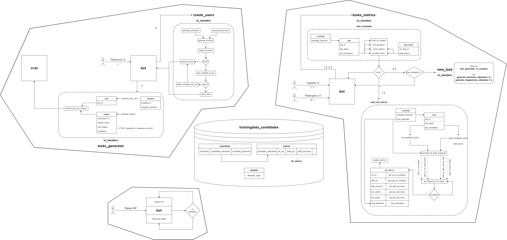
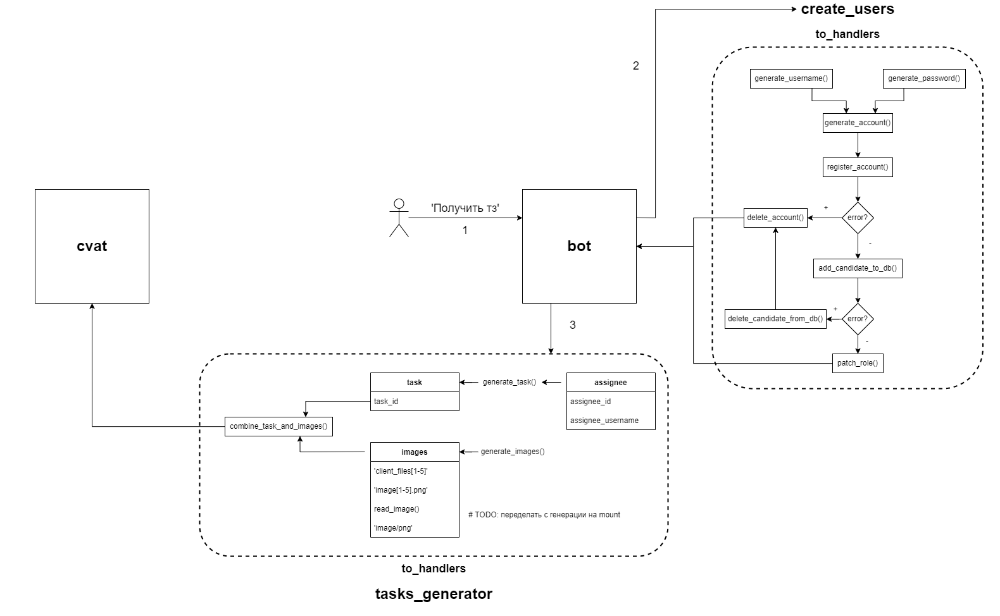
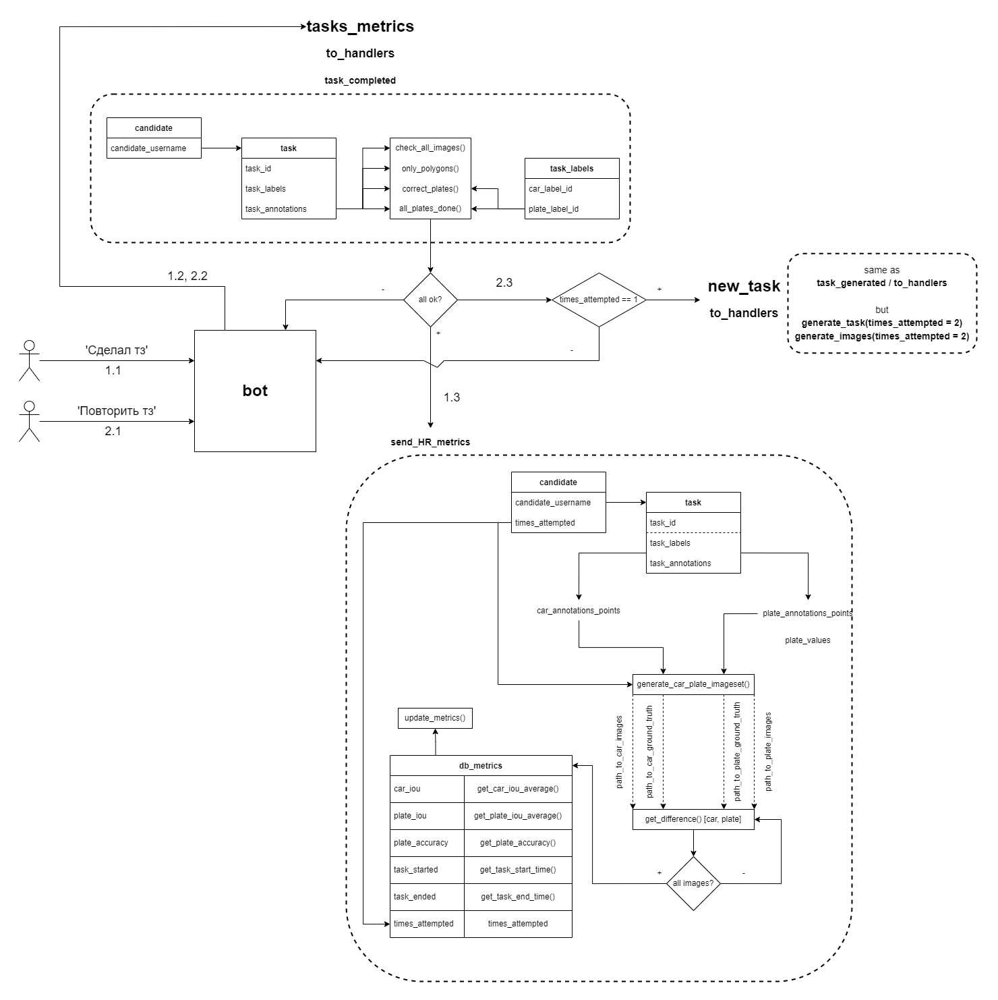
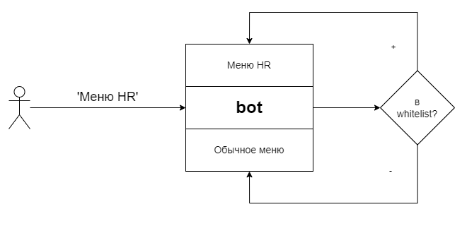
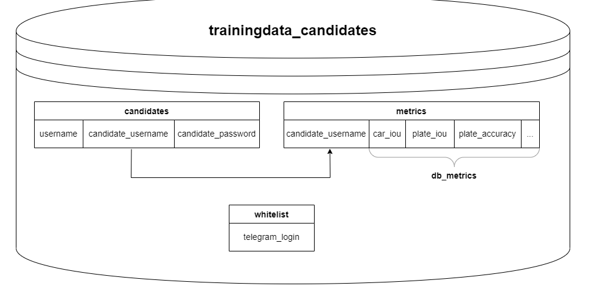
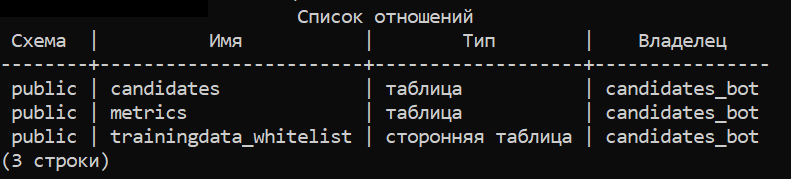
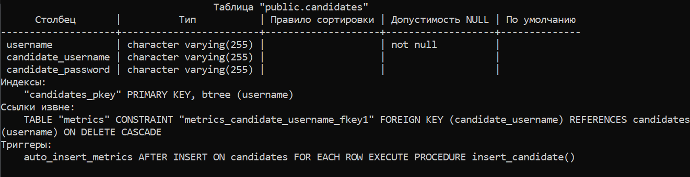
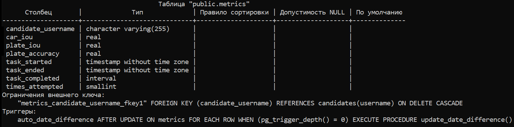
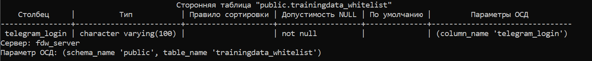

# Бот для автоматического тестирования кандидатов

в самом конце содержится **tl;dr**, если не нужно понимать/менять логику расчётов, а нужно просто функции вставить к собственным хэндлерам

# Содержание
1. [Содержание репозитория](#repo-contents)
	1. [bot_files](#bot-files)
		* `keyboards.py `
		* `/handlers`
			* `FSM_handlers.py`
			* `general_handlers.py`
	2. [config](#config)
		* `env.py`
	3. [logs](#logs)
	4. [media](#media)
	5. [create_users](#create-users)
		* `db_operations.py`
		* `generation.py`
		* `registration.py`
		* `to_handlers.py`
	6. [tasks_generator](#tasks-generator)
		* `generation.py`
		* `getters.py`
		* `types.py`
		* `to_handlers.py`
	7. [tasks_metrics](#tasks-metrics)
		* `checker.py`
		* `differences.py`
		* `generation.py`
		* `metrics.py`
		* `getters.py`
		* `to_handlers.py`
		* `types.py`
	8. [tasks_new](#tasks-new)
		* `to_handlers.py`
	9. [Другое](#other)
		*  `action_logs.py` 
		* `authorization.py`
		* `connection.py`
		* `db.py`
		* `main.py`
2. [Запуск](#run)
3. [Архитектура бота (& user experience)](#architecture)
4. [Строение базы данных](#database)
	1. [Схема](#database-schema)
	2. [Функции и триггеры](#database-triggers)
5. [Замечания по названиям](#naming)
6. [Как создаются таски](#task-creation)
7. [Метрики](#metrics)
8. [Зачем нужны getters](#getters)
9. [tl;dr](#tldr)
10. [Автор](#author) 

<a name="repo-contents"></a>
## Содержание репозитория

<a name="bot-files"></a>
### bot_files

Файлы, используемые непосредственно ботом и которые видны пользователю.
* `keyboards.py` -- клавиатуры меню, подтверждения, меню HR;
* `/handlers` -- хэндлеры сообщений, описывающие то, как бот должен отвечать на сообщения пользователей
	* `FSM_handlers.py` -- хэндлеры, использующие [Finite-State Machine](https://www.youtube.com/watch?v=nF1p1JjuR3U).
	* `general_handlers.py` -- все остальные (обычные) хэндлеры.

<a name="config"></a>
### config

Здесь хранятся конфигурационные файлы.
* `env.py` -- переменные окружения (сами переменные хранятся на сервере, их нет в репозитории по соображениям безопасности).

**Далее идут пакеты и модули, в которых содержится логика приложения и архитектуры бота. В *пакетах* всё то, что должно передаваться в пользовательский интерфейс, располагается в модулях** `to_handlers.py`. **По той же причине в** `to_handlers.py` **могут содержаться неиспользуемые импорты (чтобы избежать в хэндлерах лишних импортов).**

<a name="logs"></a>
### logs

Результат логов можно посмотреть в `action_logs.py` (TODO: переименовать).
Список логируемых функций (TODO: в будущем можно (и нужно) его расширить):
* `create_users.generation.generate_account()`
* `create_users.registration.delete_account()`
* `create_users.to_handlers.get_user_credentials()`

<a name="media"></a>
### media

Различные медиа-файлы (текстовое описание кнопок, html-сообщения для бота, картинки и **оригинальные изображения** для задач).

<a name="create-users"></a>
### create_users

Пакет, в котором содержится логика по созданию и регистрации аккаунтов, патчингу им ролей, работа с таблицей **candidates**.

* `db_operations.py` -- функции, напрямую взаимодействующие с базой данных и таблицей **candidates**. Все такие функции должны быть декорированы через `@reconnect_on_failure` (ниже - см. `db.py`).
* `generation.py` -- функции, генерирующие *username*, *пароль* и *общий payload* для регистрации в [candidates.trainingdata.solutions](candidates.trainingdata.solutions).
* `registration.py` -- функции, напрямую взаимодействующие с [candidates.trainingdata.solutions](candidates.trainingdata.solutions). Регистрация (по данным из `generation.py`) аккаунтов, их удаление, патчинг им ролей -- всё здесь. 
**Примечание**: необходимо различать удаление аккаунтов в базе данных и удаление аккаунтов на сайте. Удаление аккаунтов с сайта **не подразумевает** удаление аккаунтов с базы данных **trainingdata_candidates** и наоборот. Поэтому в `registration.py` и `db_operations.py` имеются 2 схожие функции `delete_account()` и `delete_candidate_from_db()`.
* `types.py` -- дополнительные типы, используемые в других модулях.
* `to_handlers.py` -- основной модуль, передаваемый в хэндлеры.

<a name="tasks-generator"></a>
### tasks_generator

Пакет, в котором содержится логика по созданию задач (тасков). Как создаются таски -- см. ниже в п. `Создание тасков через API`.

* `generation.py` -- функции, генерирующие таск на [candidates.trainingdata.solutions](candidates.trainingdata.solutions).
* `getters.py` -- функции-помощники, предоставляющие entry-point для функций, работающих с API [candidates.trainingdata.solutions](candidates.trainingdata.solutions). Подробнее читай ниже в п. `Зачем нужны getters`.
* `types.py` -- дополнительные типы, используемые в других модулях.
* `to_handlers.py` -- основной модуль, передаваемый в хэндлеры.

<a name="tasks-metrics"></a>
### tasks_metrics

Пакет, в котором содержится логика по проверке решения кандидатом тестового задания и подсчёта метрик.

* `checker.py` -- функции, проверяющие условия выполнения тестового задания.
* `differences.py` -- функции для подсчёта *IoU* метрики двух изображений. О метрике *IoU* читай ниже в п. `Метрики`.
* `generation.py` -- функции, генерирующие изображения (по данным от пользователя) и пути к ним. Пути к изображениям **абсолютные**. Для кроссплатформенности рекомендуется задать путь к начальной точке (папке со всеми изображениями от всех пользователей) через переменную окружения **$USER_IMAGES_DIR**, а далее использовать **относительные** пути (через `/`).
* `metrics.py` -- функции для подсчёта конечных метрик, которые отправляются HR. Также содержит функции, напрямую работающие с базой данных и таблицей **metrics**.
* `getters.py` -- функции-помощники, предоставляющие entry-point для функций, работающих с API [candidates.trainingdata.solutions](candidates.trainingdata.solutions). Подробнее читай ниже в п. `Зачем нужны getters`.
* `types.py` -- дополнительные типы, используемые в других модулях.
* `to_handlers.py` -- основной модуль, передаваемый в хэндлеры.

<a name="tasks-new"></a>
### tasks_new

Пакет, в котором содержится логика по созданию нового тестового задания и генерации таска. Логика идентична `tasks_generator`, за исключением того, что теперь `times_attempted=2` на некоторых функциях. Было решено вынести создание нового таска в отдельный модуль, чтобы не усложнять таблицы в базе данных, не передавать в функции в теле хэндлера лишние аргументы и не производить дополнительных проверок в хэндлерах.

<a name="other"></a>
**Далее идут модули, ответственные за целостность и безопасность бота. Они передают какой-то один объект во все остальные пакеты и модули.**

* `action_logs.py` (TODO: переименовать в `log.py`) -- логгирование. Передавать `@log` на функции, которые хотим логгировать в `logs/actions.log`.
* `authorization.py` -- доступ в меню HR. Передавать `@auth` на хэндлеры, которые ведут к служебным функциям.
* `connection.py` -- Соединение и работа с [candidates.trainingdata.solutions](candidates.trainingdata.solutions). Передавать `establish_connection()` в функции, которые требуют подключение к [candidates.trainingdata.solutions](candidates.trainingdata.solutions) (в качестве аргумента `session`, либо в теле соответствующей функции). Также содержит функции, работающие с API, которые экспортируются в `getters` соответствующих пакетов.
* `db.py` -- данные для подключения к базе данных **trainingdata_candidates** . Передавать `db_conn` (объект подключения) и `@reconnect_on_failure` (переподключение необходимо, так как сервер с базой данных падает независимо от сервера, на котором крутится бот) на функции, напрямую обращающиеся к базе данных.
* `main.py` -- непосредственно сам инстанс бота, файл для запуска.

<a name="run"></a>
## Запуск

(crontab -e: @reboot cd ~/trainingdata_candidates/ && source venv/bin/activate && ./run.sh)

Зависимости:
* [aiogram](https://pypi.org/project/aiogram/)
* [requests](https://pypi.org/project/requests/)
* [psycopg2](https://pypi.org/project/psycopg2/)
* [numpy](https://pypi.org/project/numpy/)
* [opencv](https://pypi.org/project/opencv-python/)
* [pandas](https://pypi.org/project/pandas/)
* [pillow](https://pypi.org/project/Pillow/)

1) Активировать виртуальное окружение: `source venv/bin/activate`
2) Если бот запускается впервые, установить зависимости: `pip install -r requirements.txt`. Иначе можно пропустить этот шаг.
3) Запустить бота: `./run.sh` (в консоли должна появиться надпись *nohup: ignoring input and appending output to 'nohup.out'* и заблокироваться ввод команд в консоль. Если консоль откликается на какие-либо команды, необходимо прочитать содержимое файла `nohup.out`)
**Предупреждение**: поскольку в боте используются переменные окружения, необходимо запускать бота конкретно через `./run.sh`, в котором прописаны все необходимые переменные.

**При возникновении ошибок** можно вручную определить все переменные окружения, использующиеся ботом, включить виртуальное окружение, установить все зависимости и ввести команду `nohup python3.10 main.py`.

<a name="architecture"></a>
## Архитектура бота (& user experience)











<a name="database"></a>
## Строение базы данных

<a name="database-schema"></a>
### Схема

База данных: **trainingdata_candidates**
3 таблицы: **candidates**, **metrics**, **trainingdata_whitelist** (о ней подробнее ниже)



**candidates** -- таблица со всеми кандидатами, которые запросили у бота логин и пароль. Содержит сам логин в Telegram, сгенерированные *username *, *пароль* для аккаунта на [candidates.trainingdata.solutions](candidates.trainingdata.solutions).



**metrics** -- таблица со всеми метриками соответствующих кандидатов.
Расшифровка (их значение см. ниже в п. `Метрики`):
* *car_iou* - средний *IoU* по машине;
* *plate_iou* - средний *IoU* по номерам машин;
* *plate_accuracy* - среднее по правильной расшифровке номеров машин;
* *task_started* - дата начала (дата запроса/повторного запроса задания (более технически, дата генерирования таска));
* *task_ended* - дата сдачи задания (первого или повторного (более технически, дата нажатия на кнопку сдачи задания при прохождении всех проверок));
* *task_completed* - время, потребовавшееся на сдачу задания (разность между *task_ended* и *task_started*);
* *times_attempted* - сколько раз кандидат выполнял тестовое задание.



**trainingdata_whitelist** -- таблица со всеми пользователями, которым разрешён доступ к функционалу HR.



**Подробнее**: изначально эта таблица использовалась в другом проекте, в другой базе данных, поэтому она является "Сторонней" или "Foreign Table". PostgreSQL не позволяет производить запросы к другой базе данных, выбрасывая ошибку `cross-database references are not implemented`.
Для этого необходимо воспользоваться расширением `postgres_fdw`, [пример](https://www.youtube.com/watch?v=C3F2JFTcg8g).
Команда `CREATE EXTENSION postgres_fdw;`должна выполняться в базе данных от пользователя (роли) с признаком СУПЕРПОЛЬЗОВАТЕЛЬ (SUPERUSER). *Yandex.Cloud* (на котором хостится база данных) не предоставляет возможности создавать пользователя с такими признаком. Для добавления расширения `postgres_fdw` необходимо через [console.cloud.yandex.ru](console.cloud.yandex.ru) выбрать нужную базу данных (**trainingdata_candidates**), добавить ей расширение `postgres_fdw`, а затем выбрать нужного пользователя, который будет ответственен за управление этим расширением (**candidates_bot**), и дать ему роль (*Grants* во всплывающем меню *Yandex*) `mdb_admin`.

За доступом в *Yandex.Cloud* обращаться к [Роману](t.me/roman_kucev). Подробнее о *Yandex.Cloud*, ролях и расширениях можно почитать [тут](https://cloud.yandex.ru/docs), [тут](https://cloud.yandex.ru/docs/managed-postgresql/concepts/roles) и [тут](https://cloud.yandex.ru/docs/managed-postgresql/operations/extensions/cluster-extensions) соответственно.

После всех махинаций с *Yandex.Cloud* сделать следующие команды:
* `CREATE SERVER fdw_server FOREIGN DATA WRAPPER postgres_fdw OPTIONS (host '<АДРЕС-ХОСТА>', dbname 'trainingdata_whitelist', port '<НОМЕР-ПОРТА>');`
* `CREATE USER MAPPING FOR candidates_bot SERVER fdw_server OPTIONS (user 'candidates_bot', password '<ПАРОЛЬ-БОТА>');`
* `IMPORT FOREIGN SCHEMA public FROM SERVER fdw_server INTO public;`

<a name="database-triggers"></a>
### Функции и триггеры

Авто подсчёт `task_completed`:
```
CREATE OR REPLACE FUNCTION
	update_date_difference()
	RETURNS trigger AS
$$
BEGIN
	UPDATE metrics
		SET task_completed = NEW.task_ended - task_started
		WHERE candidate_username = OLD.candidate_username;
    RETURN NULL;                                                                
END;
$$
LANGUAGE 'plpgsql';
```
```
CREATE TRIGGER auto_date_difference
	AFTER
		UPDATE
	ON metrics
	FOR EACH ROW
	WHEN (pg_trigger_depth() = 0) # https://stackoverflow.com/a/14262289
	EXECUTE FUNCTION update_date_difference();
```

Создание дефолтных значений метрик в таблицу `metrics` после регистрации нового пользователя в `candidates`:

```
CREATE OR REPLACE FUNCTION
	insert_candidate()
	RETURNS trigger AS
$$
BEGIN
	INSERT INTO metrics
		VALUES (NEW.username, NULL, NULL, NULL, 'now'::timestamp(0), NULL, NULL, 1);
	RETURN NULL;
END;
$$
LANGUAGE 'plpgsql';
``` 
```
CREATE TRIGGER auto_insert_whitelist
	AFTER 
		INSERT
	ON trainingdata_whitelist.public.trainingdata_whitelist
	FOR EACH ROW
	EXECUTE FUNCTION insert_in_whitelist();
```

<a name="naming"></a>
## Замечания по названиям

* *сайт* -- [candidates.trainingdata.solutions](candidates.trainingdata.solutions)
* *кандидат* -- пользователь, в контексте бизнес-логики, и сущность в контексте базы данных и телеграма, то есть в базе данных у нас *кандидаты*, к боту обращаются *кандидаты*, а на сайте проводим махинации с *аккаунтами*.
* *аккаунт* -- техническая сущность сайта. PATCH ролей производится с *аккаунтом*, с сайта удаляются *аккаунты*, путь к сгенерированному *аккаунтом* изображению и т. д.
* *таск* -- техническая сущность сайта, задание. *Таск* может состоять из *джобс*'ов (*jobs*). Если *таск* создан полностью, он отображается на главной странице *сайта* как у пользователя, так и у администраторов, если нет, то будет отображаться надпись "*Some tasks are temporary hidden because they are not fully created yet*", это значит, что к таску не подсоединились картинки, нужно либо это починить, либо удалить *таск* полностью. Логи взаимодействия пользователей с *тасками* хранятся в `/var/lib/docker/volumes/cvat_cvat_data/_data/tasks`, а картинки в `/var/lib/docker/volumes/cvat_cvat_data/_data/data`.
* *джоб* -- техническая сущность сайта, часть задания, сегмент. Кол-во *джобс*'ов определяется при первичном создании *таска* (без картинок), аргументом `segment_size` по следующей формуле:
`N_джобс = ceil(N_картинок / segment_size)`

<a name="task-creation"></a>
## Как создаются таски

Есть 2 способа создания тасков: через загрузку изображений на сервер (используется здесь), либо через *connected file share*.
Первый метод при создании таска загружает на сервер изображения, второй метод - берёт изображения из общего "хранилища" (папки). Первый метод при создании таска тратит ~6 Мб памяти ( ~12 Мб для повторной попытки соответственно).
(TODO: У меня не получилось реализовать через API второй способ, если кто будет читать это, спросите у t.me/alinya0 как)
Далее описывается способ создания таска через первый метод.

1) Создаётся "пустой" таск без изображений, но с указанием необходимых `labels` и дополнительных параметров.
`POST https://candidates.trainingdata.solutions/api/tasks`

Пример лэйблов:
```
LABELS = [
	{
		"name": "car", # название для лэйбла
		"color": "#fa3253", # цвет, отображаемый на сайте
		"attributes": []
	},
	{
		"name": "plate",
		"color":"#3d3df5",
		"attributes": [
			{
				"name": "plate",
				"mutable": False,
					# нужно ввести расшифровку номера
					# варианты Select/Radio/Checkbox/Text/Number
				"input_type": "text",
				"default_value": "",
				"values": [""]
			}
		]
	}
]
```

Сам запрос:

```
import requests


session = requests.Session()
session.auth = (<USERNAME админа>, <PASSWORD админа>)

data = {
	"name": "<НАЗВАНИЕ ТАСКА>",
	"assignee_id": <ID того, кому выдаётся таск>,
	"owner_id": <ID создателя таска>,
	"overlap": 0,
	"segment_size": <кол-во картинок на джоб (см. выше)>,
	"image_quality": 100,
	"labels": LABELS
}
session.post(
	https://candidates.trainingdata.solutions/api/tasks,
	json=data, # обязательно `json=data`, не `data=data`
)
```

2) Генерируется payload в виде
`("client_files[1]", ("image1.png", <изображение 1 в байтах>, "image/png"))`
`("client_files[2]", ("image2.png", <изображение 2 в байтах>, "image/png"))`
`...`
Изображение в байтах можно получить через `open(path_to_image, "rb")`

Конечный payload:
`list[tuple[str, tuple[str, TextIOWrapper, str]]]`

3) Добавляем изображения к "пустому" таску
`POST https://candidates.trainingdata.solutions/api/tasks/{task_id}/data`

Запрос (`task_id` = 74):
```
import requests


session = requests.Session()
session.auth = (<USERNAME админа>, <PASSWORD админа>)

data = {
	"image_quality": 100,
	"use_zip_chunks": False,
	"use_cache": False,
	"sorting_method": "natural",
	"storage": "local",
	"storage_method": "file_system",
}
session.post(
	"https://candidates.trainingdata.solutions/api/tasks/74/data",
	headers={
		"Upload-Start": "true",
		"Upload-Multiple": "true",
		"Upload-Finish": "true"
	},
	data=data,
	files=images
)
# использование `data=data`, `files=images` и необходимость хэдеров
# я не гарантирую. Такой запрос успешно работал.
```

4) При успешном объединении таска с изображениями нам должен прийти ответ, в котором должен содержаться ключ-значение `"data": <числовое значение папки на сервере>`. **Примечание**: при неуспешном объединении тоже приходит ответ "2xx", но таск остаётся "пустым". Необходимо проверять наличие ключа `"data"`, чтобы быть уверенным в успехе.

5) Данные тасков (логи, артефакты) хранятся в `/var/lib/docker/volumes/cvat_cvat_data/_data/tasks`
Картинки, прикреплённые к таску хранятся в `/var/lib/docker/volumes/cvat_cvat_data/_data/data` (та `"data"`, которую мы получили на предыдущем шаге)
В эти папки необходимо заходить под `root`'ом. Если нет пароля, можно ввести `sudo -s`, чтобы перейти в shell `root`'а, и `cd` в нужные папки.

<a name="metrics"></a>
## Метрики

* [**Intersection over Union (IoU)**](https://towardsdatascience.com/intersection-over-union-iou-calculation-for-evaluating-an-image-segmentation-model-8b22e2e84686) -- для машин и номеров:
	* Среднее значение по машинам (car_iou);
	* Среднее значение по номерам (plate_iou).
* **Plate accuracy**/**Plate value accuracy** -- точность транскрибации значений номеров машин (plate_accuracy). Индивидуальное значение либо ПОЛНОСТЬЮ правильное, либо неправильное, например:
	* Идеал: ('BITNY427', '123OwO321', 'Yy298bm')
	От пользователя: ('BITNY427', '123OWO321', 'Yу298bm')
	Результат plate accuracy = 1/3:
		* 2 значение с 'W', а в оригинале 'w';
		* 3 значение использует русскую 'у' вместо английской 'y'.
	
	Вне зависимости от сходства, различий в капитализации букв и т. п., если даже 1 символ неправильный, то всё значение считается неправильным.

* **Task started**/**Дата начала задания**. Более технически: когда кандидат подтвердил желание получить тестовое задание у бота в телеграме (task_started).
* **Task ended**/**Дата окончания задания**. Более технически: когда аккаунт последний раз редактировал разметку на [candidates.trainingdata.solutions](candidates.trainingdata.solutions) (task_ended).
* **Task completed**/**Время выполнения задания**. Более технически: разность между task_ended и task_started (task_completed).
* **Times attempted**/**Количество попыток**. Сколько раз кандидат получил тестовое задание (times_attempted). В случае повторного прохождения, **все метрики пересчитываются по последней попытке**.

<a name="getters"></a>
## Зачем нужны getters

В этом модуле располагаются helper-функции, которые позволяют изолировать каждый пакет от других, появляется единая точка входа для  взаимодействия с GET-методами API сайта, уменьшается размер кода в конечных `to_handlers.py` файлах.
Правило большого пальца: сюда писать все функции, использующие функции и/или импортирующие функционал из модуля `connection.py`.

<a name="tldr"></a>
# tl;dr

Если логику работы приложения не надо трогать, в файл с хэндлерами просто импортировать из каждого пакета модуль `to_handlers.py`, а оттуда уже нужные функции. Эти функции используют лишь те данные, которые можно вытащить из сообщений пользователей.

<a name="author"></a>
# [Автор](https://t.me/SXRu1)
